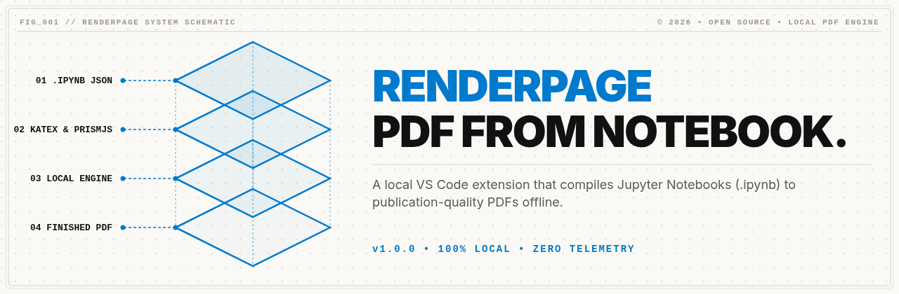
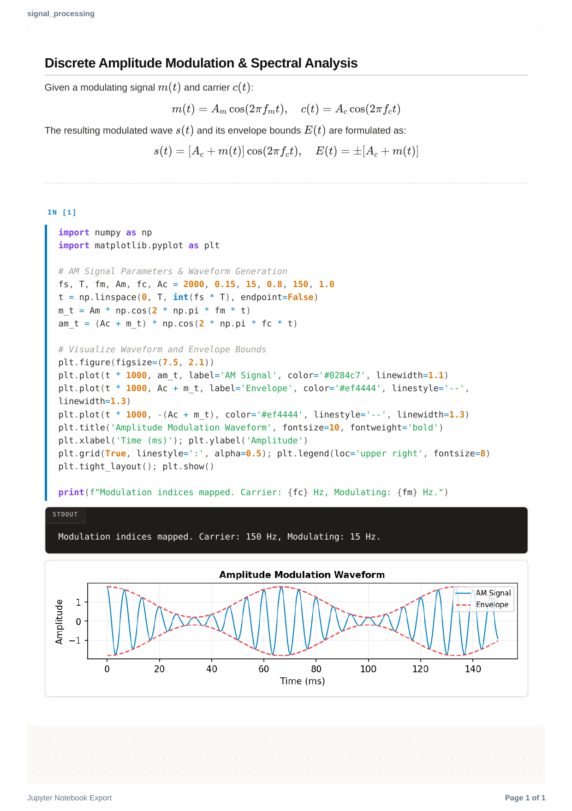
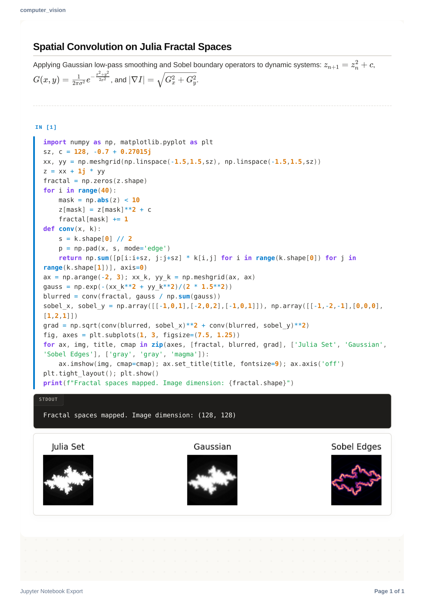
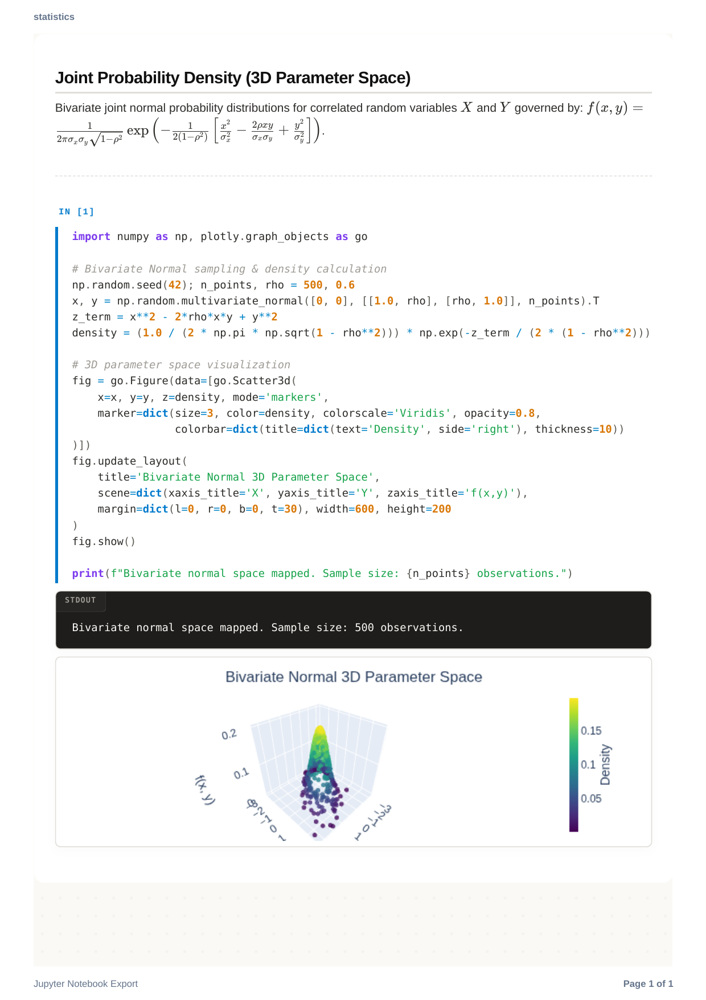
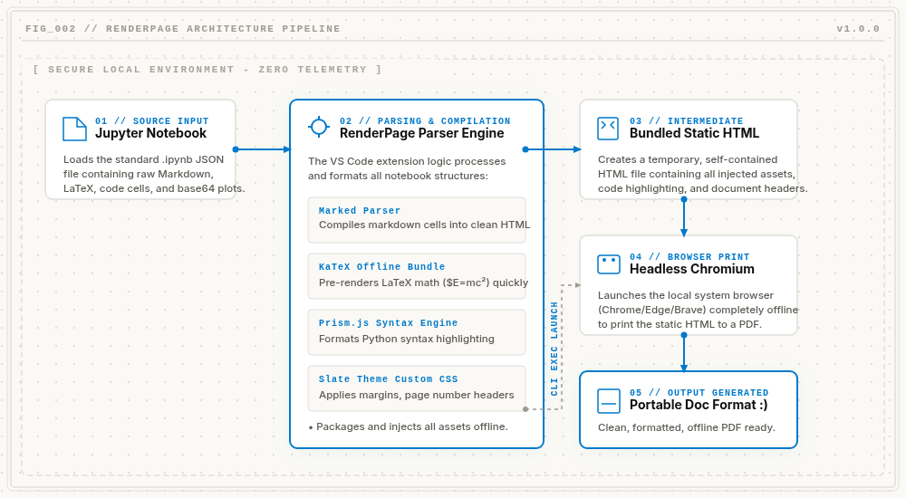

<p align="center">
  
</p>

# RenderPage

A minimal, high-fidelity, and extremely efficient VS Code extension to convert `.ipynb` Jupyter Notebooks to beautifully styled PDFs **100% locally and offline**. No external APIs, no Python/Jupyter installations required, and no heavy packages.

---

## _01 // FEATURES

* **Offline Engine**: 100% local compilation. Zero telemetry, absolute privacy, and instant PDF rendering.
* **Rich Content Support**: High-fidelity math ($LaTeX$) via KaTeX, code syntax highlighting via Prism.js, and styled Pandas tables & base64 plots.
* **Interactive Export Settings**: Premium export configuration panel to customize document metadata (Title, Author, Abstract), page margins, paper size, and running headers/footers.
* **Smart Print Layouts**: Automated CSS print media layouts to wrap long code lines and prevent graphs or code blocks from slicing across pages.

---

## _02 // PREVIEWS

<p align="center">
  
  
  
</p>

---

## _03 // PIPELINE

<p align="center">
  
</p>

---

## _04 // CONFIGURATION

Customize the PDF output in your VS Code User/Workspace Settings or standard `settings.json`:

| Setting Reference | Data Type | Default Value | Technical Description |
| :--- | :--- | :--- | :--- |
| `renderpage.paperSize` | `enum` | `"A4"` | Standard paper sizes (`"A4"`, `"Letter"`, `"Legal"`, `"A3"`). |
| `renderpage.margin` | `string` | `"15mm"` | CSS-compliant page margins (e.g., `'10mm'`, `'0.5in'`, `'20px'`). |
| `renderpage.chromePath` | `string` | `""` | Custom path to the local Chrome/Chromium/Edge executable. |

---

## _05 // QUICK START

### 1. Requirements
Prints documents using your local browser. It auto-detects standard paths for Google Chrome, Microsoft Edge, Brave, and Chromium on **Windows, macOS, and Linux**.

### 2. Compilation and Run
To compile and test the extension locally:
```bash
# 1. Install dependencies
npm install

# 2. Compile bundle
npm run compile
```
* **To Debug**: Press `F5` to open the Extension Development Host window.
* **To Export**: Open any `.ipynb` file, click the PDF button in the toolbar, or right-click the file in the Explorer tree and select **Convert Jupyter Notebook to PDF**.
